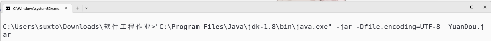

# 项目说明

## 环境说明

+ **客户端**使用 `JDK1.8` 构建，为了保证`JRE`有`JavaFX`的运行时，建议使用`JDK1.8`运行。我们使用的`JDK1.8`版本是最新的`JDK-1.8u371`，如果低于这个版本在我们的测试中会出现一些问题。
+ **服务端**使用`JDK18`构建，运行在我的阿里云服务器上，在7-30号之前服务器会一直开放，由于我们这个是多人游戏，所以如果服务器关闭了就没办法使用了。

## 运行方式

如果电脑中正确的配置了`JRE1.8`的话，应该是可以双击打开根目录下的 `YuanDou.jar`文件的。但是我并不推荐双击打开，由于`Java`默认编码的原因，双击打开和使用 `java -jar YuanDou.jar` 命令运行的话，程序内的聊天框可能出现乱码。

我的建议是在`cmd`命令行中（注意：在`powershell`中会报错），使用命令 `java -jar -Dfile.encoding=UTF-8 YuanDou.jar` 来运行，我在根目录也准备了 `bat` 批处理文件来方便运行，但是这个批处理文件是假设你的`JDK1.8`存在于默认目录（`"C:\Program Files\Java\jdk-1.8\bin\java.exe"`）。如果你的JDK在别的地方，请自行修改`bat`文件。

## 操作指南

1. 使用bat文件运行jar文件

    

2. 进入主界面

    

3. 注册/登录

    

    

    

    

4. 新建牌桌

    

    

5. 加入牌桌（双击）

    

6. 准备

    

7. 游玩界面

    

    

    

8. 结算

    

    
